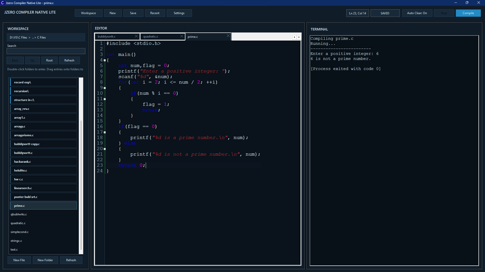
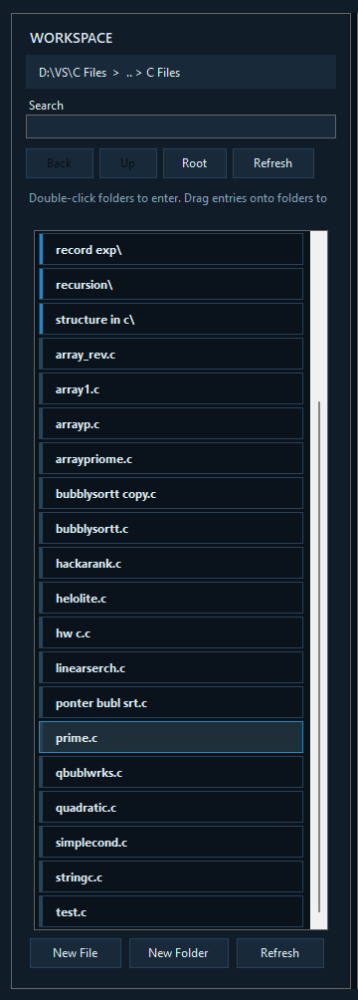
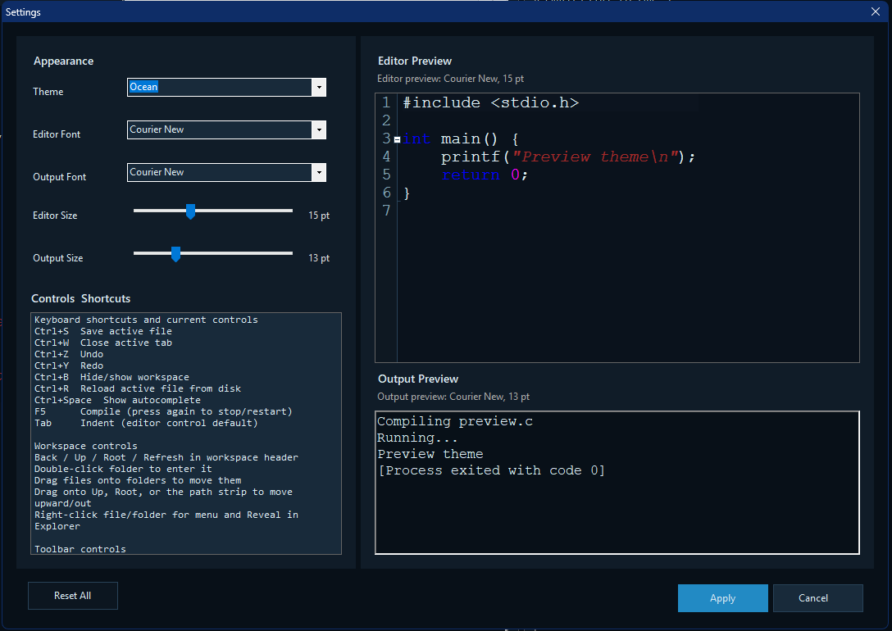
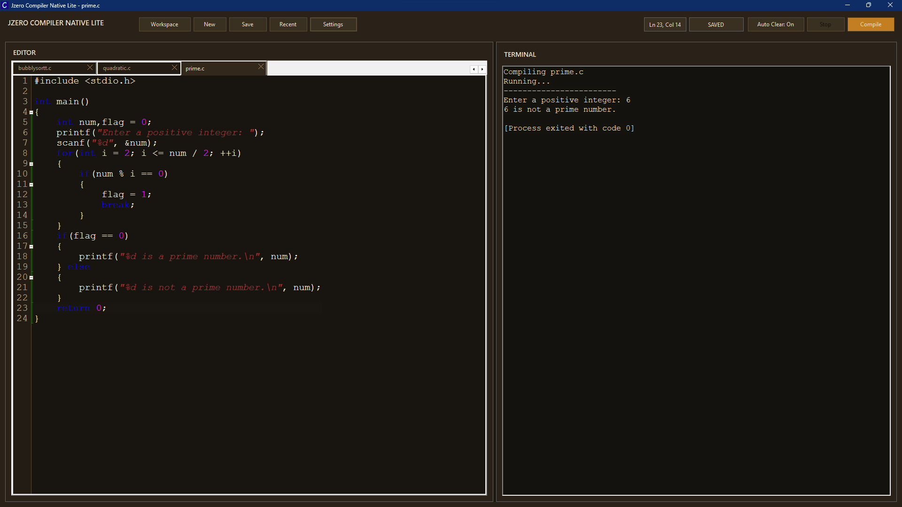
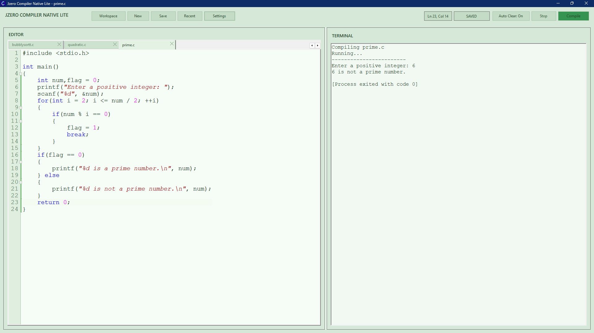

# Jzero Compiler Native Lite 🚀

**Jzero Compiler Native Lite** is a high-performance, ultra-lightweight C development environment built for developers who demand speed, aesthetics, and efficiency. As a native WinForms alternative to Electron-based IDEs, it provides a premium "God Tier" experience with a microscopic RAM footprint.

---

## ✨ Why Native Lite?

While modern IDEs consume gigabytes of memory, **Jzero Native Lite** runs on a fraction of those resources. It is optimized for engineering students and professional developers who want a lag-free, responsive environment that starts instantly and stays out of your way.

### 🔋 Extreme Efficiency
- **75% Less RAM**: Enjoy a full IDE experience without slowing down your system.
- **Native Performance**: Built with C# WinForms for maximum responsiveness.
- **Zero Configuration**: No complex setup—just open and start coding.

---

## 💎 Best Features

- **🚀 Lightning-Fast Startup**: Get from click to code in under a second.
- **💻 Pro Multi-Tab Editor**: High-performance editor powered by `FastColoredTextBox` with C syntax highlighting.
- **📂 Integrated Workspace Explorer**: 
    - Smooth list-based file browser with breadcrumb navigation.
    - Right-click actions: Open, Reveal in Explorer, Create, Rename, Delete.
    - **Drag & Drop Move**: Reorganize your projects by simply dragging files into folders.
- **🛠️ Built-in Compiler & Terminal**: 
    - Full integration with `gcc` (MinGW) for seamless compilation.
    - Interactive terminal with streamed output and stdin support.
    - One-click "Compile + Run" (`F5`) or manual Stop control.
- **🎨 Premium Customization**: 
    - Multiple stunning themes including **Ocean**, **Amber**, **Forest**, **Carbon**, and more.
    - Real-time preview of font and theme settings in a dedicated dialog.
- **🧠 Smart Productivity**: 
    - Basic Autocomplete (`Ctrl+Space`) to speed up your C coding.
    - Persistent Session: Automatically restores your open tabs and workspace layout.
    - Recent Files: Quick access to your latest work via the toolbar.

---

## 📸 Screenshots

### Modern Interface (Ocean Theme)

### Integrated Workspace & Terminal

### Beautifully Themed Settings

### Amber Theme Showcase

### Mint Light Theme Showcase

---

## ⌨️ Productivity Shortcuts

| Shortcut | Action |
| --- | --- |
| `F5` | Compile + Run (Restarts automatically if already running) |
| `Ctrl + Space` | Trigger Autocomplete |
| `Ctrl + S` | Save active file |
| `Ctrl + R` | Reload file from disk |
| `Ctrl + B` | Show/Hide Workspace |
| `Ctrl + W` | Close active tab |
| `Ctrl + Z / Y` | Undo / Redo |

---

## 🛠️ Getting Started

### Prerequisites
- **MinGW (GCC)**: Ensure `gcc.exe` is installed at `C:\MinGW\bin\gcc.exe`.

### Installation
1. Download the latest release.
2. Run `JzeroCompilerNativeLite.exe`.
3. Select your workspace folder and start coding!

### Building from Source
1. Ensure .NET Framework 4.0+ is installed.
2. Run `build.bat`.
3. The executable will be generated in the root directory.

---

Developed with ❤️ for the C community. Optimized for stability, performance, and beauty.
