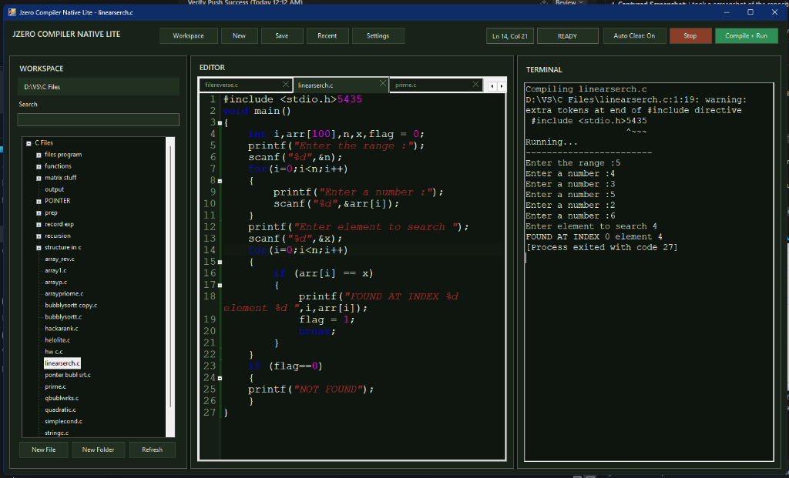
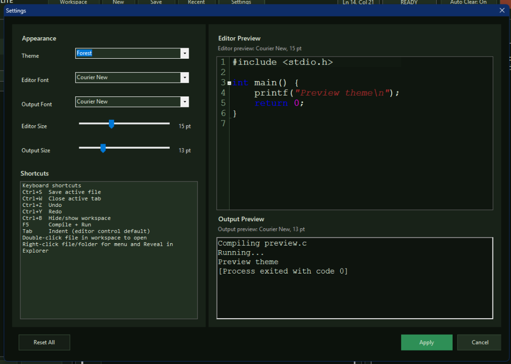
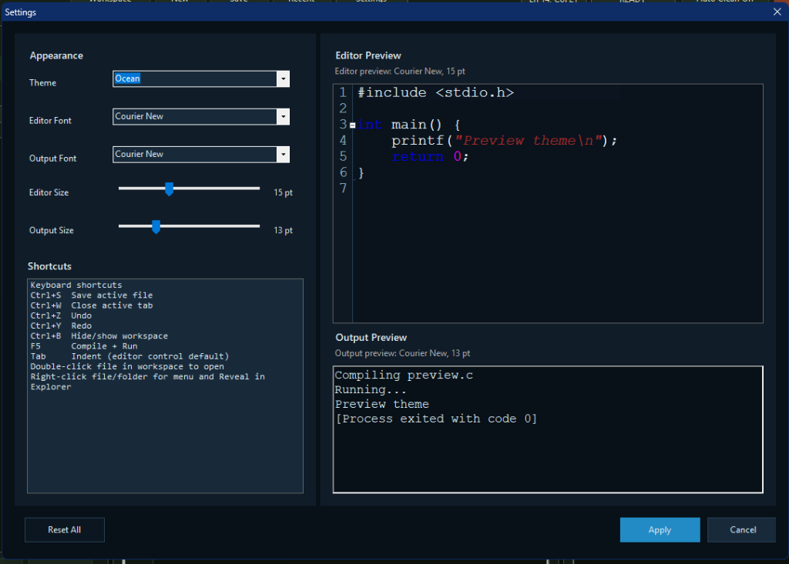

# Jzero Compiler Native Lite 🚀

**Jzero Compiler Native Lite** is a high-performance, resource-efficient C development environment. Built as a native WinForms alternative to the Electron-based JzeroCompiler, it delivers a premium IDE experience with a significantly lower RAM footprint.

---

## ✨ Key Features

- **🚀 Ultra-Lightweight**: Designed for speed and RAM efficiency using native Windows components.
- **💻 Multi-Tab Code Editor**: 
    - Powerful syntax highlighting via `FastColoredTextBox`.
    - Support for `.c`, `.h`, and `.txt` files.
    - Persistent workspace that remembers your last session.
- **📂 Integrated Workspace Explorer**:
    - Full-featured tree-view for navigating projects.
    - Quick search by both **File Name** and **File Content**.
    - Effortless file management (Open, Auto-save, Create, Rename, Delete).
- **🛠️ Built-in Compiler & Terminal**:
    - Direct integration with `gcc` (MinGW).
    - Streamed program output and interactive stdin support.
    - One-click "Compile + Run" (`F5`).
- **🎨 Modern Customization**:
    - Multiple curated themes: **Forest**, **Ocean**, and more.
    - Fully adjustable font settings for the editor and terminal output.
    - Aesthetic dark-mode UI for reduced eye strain.

---

## 📸 Screenshots

### Main Interface

### Beautifully Themed Settings
| Forest Theme | Ocean Theme |
| :---: | :---: |
|  |  |

---

## ⌨️ Productivity Shortcuts

| Shortcut | Action |
| --- | --- |
| `F5` | Compile + Run |
| `Ctrl + S` | Save active file |
| `Ctrl + W` | Close active tab |
| `Ctrl + B` | Show/Hide Workspace |
| `Ctrl + Z / Y` | Undo / Redo |
| `Tab` | Smart Indentation |

---

## 🛠️ How to Build

To build the executable from source:
1. Ensure you have the .NET Framework 4.0 or later installed.
2. Run the `build.bat` script.
3. The `JzeroCompilerNativeLite.exe` will be generated in the root directory.

*Note: Requires MinGW (`C:\MinGW\bin\gcc.exe`) installed for code compilation.*

---

## 📝 Notes
This version is optimized for stability and performance, replacing Monaco/xterm/Electron components with highly responsive native controls.
